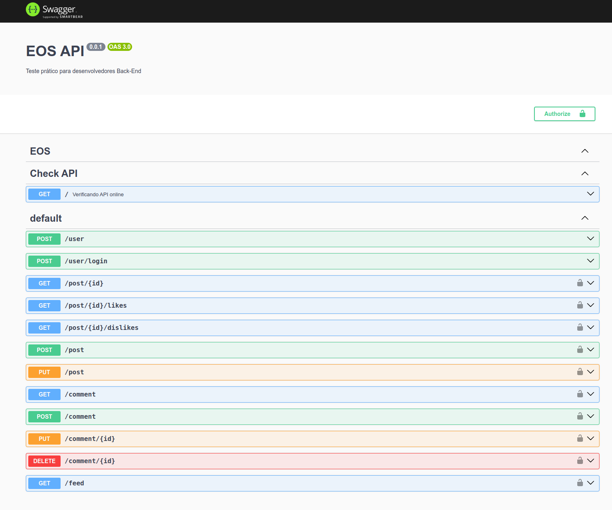

## Description

O projeto foi criado com [Nest](https://github.com/nestjs/nest) framework TypeScript.

## Requisitos

- NodeJS 18.18.1
- Docker
- Docker Compose
- Postgres

## Execução do código em container

```bash
# Se o container cair rode novamente o contêiner visto que
# o banco de dados não está em um volume
$ docker compose up -d --force-recreate --build
```


## Arquivo Postman

- [O arquivo postman está na raiz do projeto ](/OES.postman_collection.json)
- Também é possível utiliza o Swagger na rota http://localhost:3000/Swagger
- Diretório de arquivos estáticos das imagem enviadas http://localhost:3000/images



## Sistema de autenticação

- Basta criação o usuário e fazer o login utilizando a rota
  - POST http://localhost:3000/user
  - O token será retornado no header da requisição e deve ser utilizado no header da requisição para as rotas de postagem

```json
{
  "user": {
    "name": "Alvaro",
    "email": "bilu@teteia.com.br"
  },
  "password": "1234563"
}
```
- POST http://localhost:3000/user/login
  - O token será retornado no header da requisição e deve ser utilizado no header da requisição para as rotas de postagem

```json
{
    "email": "bilu@teteia.com.br",
    "password": "1234563"
}
```

- POST http://localhost:3000/post
  - O token deve ser passado no header da requisição

```form-data
{
    "post[title]": "Postagem 1",
    "post[description]": "Conteúdo da postagem 1"
    "file": arquivo.jpg
}
```

- PUT http://localhost:3000/post
  - O token deve ser passado no header da requisição
  - Edição

```json
{
    "post": {
        "id": 1,
        "title": "Titulo do Post2",
        "description": "Descriçao so post2"
    }
}
```

- GET http://localhost:3000/post/:id
  - O token deve ser passado no header da requisição
  - Detalhes do Post
```json
{
    "id": 1,
    "file": "1-1697413474362.png",
    "user_id": 1,
    "title": "Titulo do Post2",
    "description": "Descriçao so post2",
    "views": 3,
    "likes": 1,
    "dislikes": 1
}
```

- GET http://localhost:3000/post/:id/likes
  - O token deve ser passado no header da requisição
  - Contar um like

- GET http://localhost:3000/post/:id/dislikes
  - O token deve ser passado no header da requisição
  - Contar um dislike

- POST http://localhost:3000/comment
  - O token deve ser passado no header da requisição
  - Criação de um comentário em um post

```json
{
    "comment": {
        "post_id": 1,
        "description": "Descrição dsds"
    }
}
```

- PUT http://localhost:3000/comment/:id
  - O token deve ser passado no header da requisição
  - Edição de um comentário em um post

```json
{
    "comment": {
        "description": "Descrição 2"
    }
}
```

- DELETE http://localhost:3000/comment/:id
  - O token deve ser passado no header da requisição
  - Deletar um comentário em um post

# run

## Installation

```bash
$ npm install
````

## Running the app

```bash
# development
$ npm run start

# watch mode
$ npm run start:dev

# production mode
$ npm run start:prod
```

## Test

```bash
# test coverage
$ npm run test:cov
TODO: Teste não totalizado em todas as rotas
```

## Stay in touch

- Alvaroico - [Álvaro Ribeiro Pereira](https://github.com/alvaroico)

## License

Nest is [MIT licensed](LICENSE).
